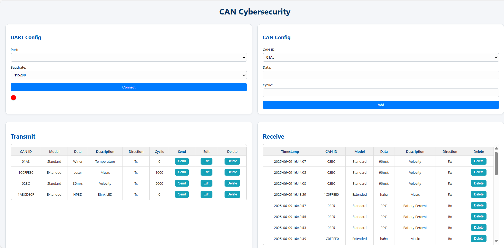
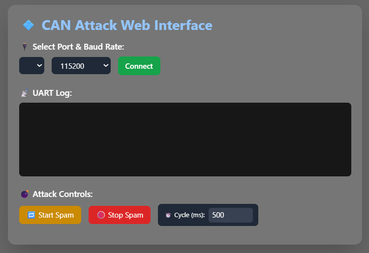
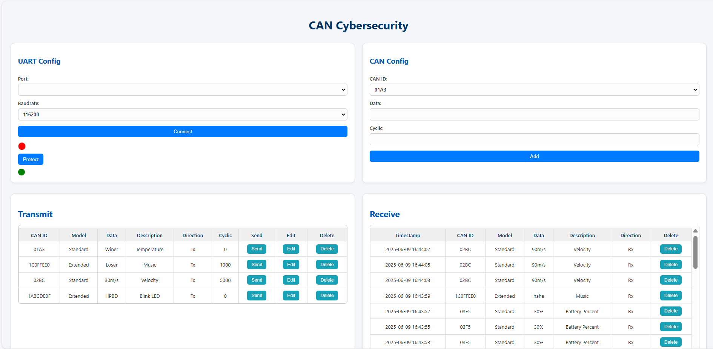

# 🚗 CyberCAN Defense  
### Phát hiện và Phòng thủ Xâm nhập Mạng Nội Bộ Ô Tô

---

## 📌 Mục tiêu dự án

CyberCAN Defense là một hệ thống mô phỏng và kiểm chứng các hình thức **tấn công mạng trên CAN bus** trong ô tô bằng Replay Attack, đồng thời đề xuất giải pháp **phòng thủ hiệu quả** nhằm đảm bảo an toàn cho hệ thống điều khiển nội bộ xe hơi.

---

## ⚙️ Thành phần chính

### 1. Giao tiếp CAN cơ bản
- Thiết lập 2 node truyền/nhận dữ liệu qua giao thức CAN.
- Chưa tích hợp cơ chế xác thực hay mã hóa.
  
📷 Giao diện truyền nhận CAN chưa có bảo vệ

  

---

### 2. Giao tiếp 2 chiều giữa các node
- Hai chiều tương tác hoàn toàn qua CAN: node A gửi → node B nhận → phản hồi lại node A.
  
🔗 [\_Video truyền 2 chiều\_](https://drive.google.com/file/d/1pCK5nHrGLEExHY9vXCKYeSlwlsF2VMLN/view?usp=sharing)

---

### 3. Tấn công CAN: Replay & Spam Attack

- Sử dụng giao diện web trực quan để khởi tạo tấn công spam gói CAN.
- Tạo gói dữ liệu giả lặp lại nhằm làm nhiễu hệ thống đích (replay).
  
📷 Giao diện tấn công CAN

  

🔗 [\_Video tấn công\_](https://drive.google.com/file/d/11zdeIVfv-vaAChAkVgTNAaR4zFdM-Rix/view?usp=sharing)

---

### 4. Phòng thủ: Phát hiện hành vi bất thường

- Sử dụng thuật toán phát hiện bất thường.
- Gửi cảnh báo khi phát hiện hành vi lặp bất thường.
- 📷 Giao diện truyền nhận CAN có bảo vệ

  

🔗 [\_Video cơ chế phòng thủ\_](https://drive.google.com/file/d/18BFm1vB-RNR5hPCvwW3EDyKrHqGFu9gw/view?usp=sharing)

---

## 🧰 Công nghệ sử dụng

- ⚙️ **CAN Protocol**
- 👨‍💻 **STM32F103C8T6**
- 📟 **MCP2551 CAN Transceiver**
- 🌐 **WebSerial (HTML + JS + Flask Python)** cho giao diện truyền, nhận và  tấn công
- 📡 **UART Log** để hiển thị

---

## 🧠 Tính năng nổi bật

- ✅ Giao tiếp CAN song công mô phỏng thực tế.
- 🛑 Mô phỏng kỹ thuật tấn công phổ biến: Replay Attack.
- 🛡️ Phát hiện và cảnh báo tấn công bất thường dựa trên thống kê.
- 🔎 Giao diện web giúp điều khiển & quan sát dễ dàng.

---
## 👩‍💻 Nhóm thực hiện: 12

- **Thành viên 1:** Quách Ngọc Quang – Kỹ thuật máy tính 
- **Thành viên 2:** Nguyễn Tuấn Phong – Kỹ thuật máy tính 
- **Thành viên 3:** Đoàn Đức Mạnh – Kỹ thuật máy tính
- **Thành viên 4:** Nguyễn Minh Phúc – Kỹ thuật máy tính  

🎓 **Trường:** Đại học Công nghệ – ĐHQGHN (UET)  
🏫 **Khoa:** Điện tử viễn thông  
🛠️ **Môn học:** Cơ sở đo lường và điều khiển số

---

## 📬 Liên hệ

📧 Email nhóm: csdlteam3@gmail.com  
🔗 GitHub: [[github.com/CyberCAN-Defense](https://github.com/CyberCAN-Defense)](https://github.com/JerryK4)

---

